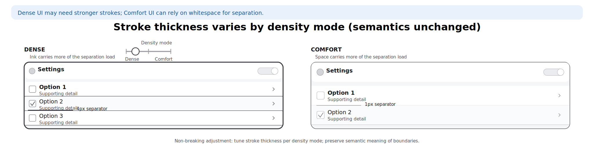

# CEM D5 Stroke & Separation — Boundaries, Dividers, and Focus Indicators

**Status:** Proposed (canonical CEM spec)  
**Last updated:** December 19, 2025

**Taxonomy placement:** D5. Stroke & Separation (part of the 7-dimensional CEM token framework)

**Companion specs:**
- **D0. Color (Emotional Palette & System Color Mapping)** ([`cem-colors.md`](./cem-colors.md)) — defines separator/focus colors; D5 defines *thickness and geometry*
- **D1. Space & Rhythm** ([`cem-dimension.md`](./cem-dimension.md)) — inset/spacing rules that keep strokes readable without crowding
- **D2. Coupling & Compactness** ([`cem-coupling.md`](./cem-coupling.md)) — density modes that affect when thin strokes must become stronger
- **D3. Shape — Bend** ([`cem-shape.md`](./cem-shape.md)) — corner radii and rounding rules that strokes must follow
- **D4. Layering** ([`cem-layering.md`](./cem-layering.md)) — when to prefer shadow separation vs stroke separation
- **D7. Time & Motion** ([`cem-timing.md`](./cem-timing.md)) — animation timing for focus/selection transitions

---

## Contents

1. [What D5 controls](#1-what-d5-controls)
2. [Design goals](#2-design-goals)
3. [Minimal stroke basis](#3-minimal-stroke-basis)
4. [Semantic endpoints (product-facing contract)](#4-semantic-endpoints-product-facing-contract)
5. [Focus, selected, and target indicators](#5-focus-selected-and-target-indicators)
6. [Dividers and separators](#6-dividers-and-separators)
7. [Inter-dimension coupling](#7-inter-dimension-coupling)
8. [Accessibility and forced-colors requirements](#8-accessibility-and-forced-colors-requirements)
9. [Implementation guidance (CSS recipes)](#9-implementation-guidance-css-recipes)
10. [Framework mapping guidance (Angular Material, MUI)](#10-framework-mapping-guidance-angular-material-mui)
11. [Canonical token summary](#11-canonical-token-summary)
12. [Governance and versioning](#12-governance-and-versioning)
13. [References](#13-references)

---

## 1. What D5 controls

D5 defines the **geometry of separation**:

- **Stroke thickness**: borders, hairlines, dividers, gridlines, outlines.
- **Indicator geometry**: focus rings, selection rings, target indicators (including patterned outlines such as zebra).
- **Stroke placement**: whether an indicator is *inside* the component, *on the edge*, or *outside* the component.

D5 **does not** define:
- **Colors** (D0 defines `Canvas`, `CanvasText`, `SelectedItem`, emotional palettes, etc.).
- **Spacing and inset** (D1).
- **Component height or density rules** (D2).
- **Corner rounding** (D3).
- **Motion curves and timing** (D7).

---

## 2. Design goals

### 2.1 Consumer semantics first

Tokens must express *what the stroke means to the consumer*, not how it is implemented:

- “boundary” vs “divider” vs “focus indicator” vs “selection indicator”
- not “mdc notched-outline width” or “outlined input border width”

### 2.2 Bounded complexity

Stroke systems can explode into per-component and per-state width tokens. CEM avoids that by defining:

- a **small width basis** (few values)
- a **small set of semantic endpoints**
- and **mapping guidance** for frameworks that expose many internal variables.

### 2.3 No layout shift on interaction

Changing border width on focus is a common source of **layout shift** (e.g., label jumps in outlined text fields). Focus and selection indicators should be drawn using **outline** or **box-shadow**, or on a pseudo-element, rather than changing border-box geometry.

### 2.4 Accessibility as a hard constraint

D5 must support modern focus-indicator requirements (including minimum visible area/thickness and sufficient contrast in high-contrast themes). See §8.

---

## 3. Minimal stroke basis

CEM D5 uses a **4-step stroke basis** that covers almost all UI needs without a large token surface.

### 3.1 Stroke basis tokens

> These tokens are *foundational*. Semantic endpoints map to them.

```css
:root {
  /* Basis: keep small and stable */
  --cem-stroke-none:     0px;  /* no stroke */
  --cem-stroke-hair:     1px;  /* hairline separators, subtle boundaries */
  --cem-stroke-standard: 2px;  /* focus/selection indicators; high legibility */
  --cem-stroke-strong:   3px;  /* high-emphasis boundaries; contrast themes */
}
```

**Notes**
- `1px` remains device-independent (CSS px), and is appropriate for dividers and subtle component boundaries.
- `2px` is the default for **focus visibility** and state distinction.
- `3px` exists primarily for **high contrast** and “hard separation” contexts.

- Material Design component specs frequently use 1–2dp stroke thickness for outlines and focus indicators; in web CEM this maps cleanly onto `1px` hairlines and `2px` indicators (see References for representative component spec links and issue discussions).


### 3.2 Density coupling (D2 interaction)

Stroke thickness is allowed to vary *by density mode* as a **non-breaking** adjustment, as long as semantics stay intact:

- Dense UI may need **stronger strokes** because small targets and reduced whitespace reduce separability.
- Comfort UI can remain at hairline boundaries in more places because whitespace carries part of the separation work.

---

## 4. Semantic endpoints (product-facing contract)

These are the **canonical semantic endpoints** that components consume.

### 4.1 Endpoints

```css
:root {
  /* Canonical boundaries */
  --cem-stroke-boundary:          var(--cem-stroke-hair);

  /* Canonical separators */
  --cem-stroke-divider:           var(--cem-stroke-hair);

  /* Canonical indicators */
  --cem-stroke-focus:             var(--cem-stroke-standard);
  --cem-stroke-selected:          var(--cem-stroke-standard);
  --cem-stroke-target:            var(--cem-stroke-standard);

  /* Placement */
  --cem-stroke-indicator-offset:  2px; /* distance outside the edge, not thickness */

  /* Optional convenience endpoints (aliases, not required by contract) */
  --cem-stroke-grid:              var(--cem-stroke-divider);        /* tables / data grids */
  --cem-stroke-boundary-strong:   var(--cem-stroke-standard);       /* dialogs / sheets when needed */
}
```

### 4.2 Semantics (normative)

- `--cem-stroke-boundary` is the default edge for **control containers** (text fields, chips, cards, tiles).
- `--cem-stroke-divider` separates **siblings** (list rows, table rows, sections).
- `--cem-stroke-focus` is for **keyboard focus** (and must meet §8).
- `--cem-stroke-selected` marks **selection** where background does not carry the whole burden of state (CEM preference).
- `--cem-stroke-target` marks a **deep-linked / navigated-to** target (e.g., URL fragment target, “jump to result”).
- `--cem-stroke-indicator-offset` prevents rings/indicators from visually merging with the component edge.

Optional convenience endpoints (aliases):

- `--cem-stroke-grid` is a readability alias for “divider inside structured content” (tables / data grids).
- `--cem-stroke-boundary-strong` is a stronger boundary used only when elevation/shadow is unavailable or insufficient.

---

### 4.3 Component mapping matrix (informative)

The D5 contract intentionally avoids per-component thickness tokens (e.g., `--cem-input-outline`). Instead:

- Components bind to one of the **semantic endpoints** (boundary/divider/focus/selected/target).
- Component libraries may expose **adapter variables** with component-friendly names, but those adapter names are *not* part of the canonical CEM contract.

> Rule of thumb: **color is D0**, **thickness is D5**, **corner curvature is D3**, **spacing/insets is D1**, **density-mode overrides are D2**.

| Component family                         | Primary D5 endpoint(s)                                 | Typical stroke usage           | Notes                                                                                                                      |
|------------------------------------------|--------------------------------------------------------|--------------------------------|----------------------------------------------------------------------------------------------------------------------------|
| Dividers (horizontal/vertical)           | `--cem-stroke-divider`                                 | 1px hairline between siblings  | Prefer inset patterns for lists; increase strength in dense or low-contrast contexts.                                      |
| List item separators                     | `--cem-stroke-divider` (or `--cem-stroke-grid`)        | Row separators                 | Treat dense “data-list” layouts as a grid for readability.                                                                 |
| Table borders / grid lines               | `--cem-stroke-grid`                                    | Cell/row separators            | Use `grid` to distinguish “structured separators” from generic dividers; same thickness by default.                        |
| Text field outline (outlined pattern)    | `--cem-stroke-boundary`                                | Control container edge         | Focus indication should be a ring (`--cem-stroke-focus`) rather than mutating border width.                                |
| Text field underline (filled pattern)    | `--cem-stroke-boundary` or `--cem-stroke-divider`      | Baseline boundary              | Underline is a boundary of the control, not a sibling divider; map to divider only when visually used as “row separation”. |
| Outlined button border                   | `--cem-stroke-boundary`                                | Variant boundary               | Use `boundary-strong` only for “hard separation” themes (e.g., low-elevation UIs).                                         |
| Card / tile border                       | `--cem-stroke-boundary` (often `--cem-stroke-none`)    | Optional edge                  | Prefer D4 elevation or D0 surface contrast; use boundary only when needed for scannability.                                |
| Checkbox / radio container border        | `--cem-stroke-boundary`                                | Control boundary               | The checkmark/dot is not a stroke token concern; it is icon geometry (D3) + color (D0).                                    |
| Switch track outline (if any)            | `--cem-stroke-boundary`                                | Track boundary                 | Track *height* is D2/D1, not D5; D5 only provides line weight if outlined.                                                 |
| Chip / badge border (bordered variant)   | `--cem-stroke-boundary`                                | Subtle outline                 | In dense chips, consider mapping `boundary` → `standard` via D2 coupling if needed for separation.                         |
| Tabs / segmented control indicator       | `--cem-stroke-selected`                                | Active underline/bar thickness | Avoid using `divider` for active indicators; indicators communicate state, not separation.                                 |
| Focus ring (all controls)                | `--cem-stroke-focus` + `--cem-stroke-indicator-offset` | External ring/outline          | Must satisfy WCAG 2.2 focus appearance (§8.1).                                                                             |
| Target highlight (deep link / “jump to”) | `--cem-stroke-target`                                  | Temporary outline/ring         | Distinct from focus: target is navigational, focus is interactive.                                                         |
| Menus / dropdowns / popovers (edge)      | `--cem-stroke-boundary` (often none)                   | Optional border                | Prefer D4 shadow separation; use boundary/boundary-strong in forced-colors or shadow-suppressed contexts.                  |
| Progress/slider tracks                   | (usually none) / `--cem-stroke-boundary`               | Outline only if required       | Track *thickness* (e.g., 8px) is a **dimension**; treat that as D2/D1, not D5.                                             |


## 5. Focus, selected, and target indicators

CEM uses an **outline-driven indicator** model for states that must remain visible across backgrounds:
- focus (keyboard / focus-visible)
- selected
- target (e.g., anchor `:target`)

### 5.1 Zebra outline system (existing in `theme-data.xhtml`)

The current theme implementation uses a **zebra ring** composed of stacked outside strokes using `box-shadow` and zebra color variables:

- `--cem-zebra-strip-size`
- `--cem-zebra-color-0` … `--cem-zebra-color-3`
- `--cem-action-box-shadow` (used by `.action` components)

In normal themes, a 3-stripe ring is used; in contrast themes, a 4-stripe ring is used (intent + focus + selected + target).

### 5.2 Canonical zebra tokens (D5 contract)

D5 treats these as canonical *indicator-pattern tokens*:

```css
:root {
  --cem-zebra-strip-size: 2px;      /* thickness per stripe */
  --cem-zebra-angle:      45deg;    /* if stripes are rendered as gradients */
  --cem-zebra-color-0:    Canvas;       /* intent / base stripe (contrast themes) */
  --cem-zebra-color-1:    CanvasText;   /* focus stripe */
  --cem-zebra-color-2:    SelectedItem; /* selected stripe */
  --cem-zebra-color-3:    SelectedItem; /* target stripe (or themed alternative) */
}
```

### 5.3 Recommended indicator composition (box-shadow ring)

```css
/* 3-stripe ring: focus/selected/target (normal themes) */
--cem-ring-zebra-3:
  0 0 0 calc(1 * var(--cem-zebra-strip-size)) var(--cem-zebra-color-1),
  0 0 0 calc(2 * var(--cem-zebra-strip-size)) var(--cem-zebra-color-2),
  0 0 0 calc(3 * var(--cem-zebra-strip-size)) var(--cem-zebra-color-3);

/* 4-stripe ring: intent + focus + selected + target (contrast themes) */
--cem-ring-zebra-4:
  0 0 0 calc(1 * var(--cem-zebra-strip-size)) var(--cem-zebra-color-0),
  0 0 0 calc(2 * var(--cem-zebra-strip-size)) var(--cem-zebra-color-1),
  0 0 0 calc(3 * var(--cem-zebra-strip-size)) var(--cem-zebra-color-2),
  0 0 0 calc(4 * var(--cem-zebra-strip-size)) var(--cem-zebra-color-3);
```

**Why `box-shadow`?**
- Avoids layout shift (unlike border-width changes).
- Works with rounded corners (D3) and can visually sit outside the component.
- Can be swapped to `outline` in forced-colors contexts (§8.2).

### 5.4 Focus heuristics

Prefer `:focus-visible` semantics. If the platform needs a polyfilled focus-ring behavior, align with heuristics similar to Material Web’s focus ring utilities (see references).

---

## 6. Dividers and separators

### 6.1 Divider role types

CEM recognizes three common divider roles (same thickness basis, different usage):

1. **Section divider**: separates groups (higher salience)
2. **Row divider**: list/table row hairlines
3. **Gridline**: dense tabular separation

All three should normally map to `--cem-stroke-divider` (hairline). Promote to `--cem-stroke-boundary-strong` when:
- the UI is dense (D2)
- the background is textured/animated
- or the consumer must not miss the separation (e.g., critical comparison tables).

### 6.2 Inset patterns (non-token guidance)

Avoid creating many inset tokens. Use a single **inset rule**:
- “Full-bleed dividers for full-bleed lists”
- “Inset dividers under leading avatar/icon to preserve grouping”

Spacing and inset should use D1 tokens.

---

## 7. Inter-dimension coupling

### 7.1 D3 shape coupling

Indicator rings should follow component rounding:

```css
border-radius: var(--cem-bend-control);
box-shadow: var(--cem-ring-zebra-3);
```

If the ring is outside, it may require a slightly larger radius:

```css
border-radius: calc(var(--cem-bend-control) + var(--cem-stroke-indicator-offset));
```

### 7.2 D1 spacing coupling

Where indicators sit outside the edge, ensure surrounding layout provides enough breathing room. Prefer:
- container padding (D1)
- or internal “guard rails” around interactive controls (D2), including `--cem-coupling-guard-min`
  and `--cem-coupling-halo`

Treat `--cem-coupling-guard-min` as the default clearance budget between adjacent operable zones.
If you increase any of the following, you must also increase surrounding D1 spacing and/or D2 guard/halo
(or accept overlap):

- zebra ring outset: `3 * --cem-zebra-strip-size` (normal) / `4 * --cem-zebra-strip-size` (contrast)
- outline outset: `--cem-stroke-indicator-offset + --cem-stroke-focus`

See the D2 compatibility rule in [`cem-coupling.md`](./cem-coupling.md) §4.1.1.

### 7.3 D4 elevation coupling

Elevation and stroke are substitutes:
- Use elevation for depth separation in normal themes where shadows are viable.
- Use stroke (including zebra) in contrast themes, where shadows can be insufficient.

---

## 8. Accessibility and forced-colors requirements

### 8.1 Focus appearance (WCAG 2.2)

The focus indicator must be large/visible enough to be reliably perceived. A robust default is a **2px** perimeter (or equivalent area) around the focused component, which D5’s `--cem-stroke-focus` supports.

### 8.2 Forced colors / high contrast

In `forced-colors: active` contexts:
- prefer `outline` (system colors) and avoid relying on subtle shadows
- avoid gradients that may be flattened
- ensure indicator uses `CanvasText` / `Highlight` as appropriate in D0 mapping

Suggested baseline:

```css
@media (forced-colors: active) {
  .cem-focusable:focus-visible {
    outline: var(--cem-stroke-focus) solid CanvasText;
    outline-offset: var(--cem-stroke-indicator-offset);
    box-shadow: none;
  }
}
```

---

## 9. Implementation guidance (CSS recipes)

### 9.1 Prefer rings over border-width mutation

**Avoid**
```css
/* Causes layout shift */
.control:focus { border-width: 2px; }
```

**Prefer**
```css
.control:focus-visible {
  outline: var(--cem-stroke-focus) solid currentColor;
  outline-offset: var(--cem-stroke-indicator-offset);
}
```

or (for rounded geometry / zebra):
```css
.control:focus-visible {
  box-shadow: var(--cem-ring-zebra-3);
}
```

### 9.2 Layering order for multiple indicators

If multiple indicators can apply, compose in a stable order:
1. focus
2. selected
3. target

In zebra, this is naturally expressed as concentric stripes.

### 9.3 Action components (existing pattern)

Current implementation uses:

```css
.action { box-shadow: var(--cem-action-box-shadow); }
.action:hover { --cem-action-box-shadow: var(--cem-action-box-shadow-hover); }
.action:active { --cem-action-box-shadow: var(--cem-action-box-shadow-active); }
```

In contrast themes, `--cem-action-box-shadow` becomes the zebra ring.

---

## 10. Framework mapping guidance (Angular Material, MUI)

This section is **non-normative**. It documents how to map framework tokens/variables into the CEM D5 semantic endpoints.

### 10.1 Angular Material (MDC-based) mapping

Common MDC variables (examples seen in Angular Material customization workflows):

- `--mdc-outlined-text-field-outline-width` → `--cem-stroke-boundary`
- `--mdc-outlined-text-field-focus-outline-width` → `--cem-stroke-focus` (or `--cem-stroke-boundary-strong`)
- `--mdc-filled-text-field-active-indicator-height` → `--cem-stroke-divider`
- `--mdc-filled-text-field-focus-active-indicator-height` → `--cem-stroke-focus`
- `--mdc-outlined-card-outline-width` → `--cem-stroke-boundary`

Angular Material also exposes higher-level variables in some setups, e.g.:
- `--mat-form-field-outlined-focus-outline-width` → `--cem-stroke-focus`

**Guidance:** map these variables *from* CEM tokens; do not treat them as canonical tokens in CEM.

### 10.2 MUI mapping

**MUI System**
- `sx={{ border: 1 }}` expresses a border thickness via the theme’s `borders` scale.
- Map `border: 1` (typical) to `--cem-stroke-boundary` (hairline).

**MUI Joy UI**
Joy exposes per-component CSS variables for focus ring geometry (examples):
- `--Input-focusedThickness` → `--cem-stroke-focus`
- `--Input-focusedInset` → whether focus is inset or outset (maps to indicator placement policy)
- `--Input-focusedOffset` → `--cem-stroke-indicator-offset`

---

## 11. Canonical token summary

| Token | Category | Required | Meaning |
|------|----------|----------|---------|
| `--cem-stroke-none` | Basis | ✓ | No stroke |
| `--cem-stroke-hair` | Basis | ✓ | 1px hairline |
| `--cem-stroke-standard` | Basis | ✓ | 2px standard indicator |
| `--cem-stroke-strong` | Basis | ✓ | 3px strong separation |
| `--cem-stroke-boundary` | Semantic | ✓ | Default component boundary |
| `--cem-stroke-boundary-strong` | Semantic | Optional | Strong boundary for cases where elevation/shadow cannot carry separation |
| `--cem-stroke-divider` | Semantic | ✓ | Default separator/divider |
| `--cem-stroke-grid` | Semantic | Optional | Divider alias for structured content (tables/grids) |
| `--cem-stroke-focus` | Semantic | ✓ | Focus-visible indicator width |
| `--cem-stroke-selected` | Semantic | ✓ | Selection indicator width |
| `--cem-stroke-target` | Semantic | ✓ | Target indicator width |
| `--cem-stroke-indicator-offset` | Placement | ✓ | Ring/outline offset distance |
| `--cem-zebra-strip-size` | Pattern | Optional | Stripe thickness for zebra indicators |
| `--cem-zebra-angle` | Pattern | Optional | Stripe angle for gradient zebra |
| `--cem-zebra-color-0..3` | Pattern | Optional | Concentric zebra stripe colors (intent/focus/selected/target) |
| `--cem-action-box-shadow` | Adapter hook | Optional | Existing action indicator/shadow hook (implementation detail) |

---

## 12. Governance and versioning

### 12.1 What counts as breaking

Treat as **major** (breaking) if you:

- Rename or remove any **Required (✓)** D5 endpoint listed in §11.
- Change the semantic meaning of an endpoint (e.g., `--cem-stroke-focus` no longer representing focus thickness).
- Remove zebra token meanings that consumers rely on (e.g., swapping which stripe denotes focus).

### 12.2 What is non-breaking

Treat as **minor/patch** if you:

- Adjust numeric values within a theme while preserving semantics (e.g., `2px` → `3px` in contrast theme only).
- Add new optional endpoints that are clearly scoped.
- Clarify documentation, examples, or mapping guidance.

---

## 13. References

- W3C WCAG 2.2 Understanding: Focus Appearance (Minimum) — https://www.w3.org/WAI/WCAG22/Understanding/focus-appearance.html
- MDN: `:focus-visible` — https://developer.mozilla.org/en-US/docs/Web/CSS/:focus-visible
- Material Web focus ring documentation — https://github.com/material-components/material-web/blob/main/docs/components/focus-ring.md
- Material Design 3 component specs (stroke/focus indicator values are listed per component):
  - Menus (specs) — https://m3.material.io/components/menus/specs
  - Checkbox (specs) — https://m3.material.io/components/checkbox/specs
- Google issue tracker example referencing OutlinedTextField outline thickness in specs — https://issuetracker.google.com/issues/191543915

- Angular Material customization guidance — https://v12.material.angular.io/guide/customizing-component-styles
- Angular Material outlined form-field focus border width discussion (example) — https://github.com/angular/components/issues/28023
- Angular Material customization examples showing outline width variables (examples):
  - https://www.fusonic.net/en/blog/angular-material-customization
  - https://dev.to/dhutaryan/how-to-make-angular-material-inputs-look-like-simple-fields-3oe5
- MUI System borders utilities — https://mui.com/system/borders/
- MUI Joy UI Input variables (focus thickness/offset) — https://mui.com/joy-ui/react-input/
