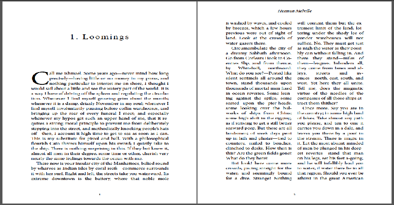
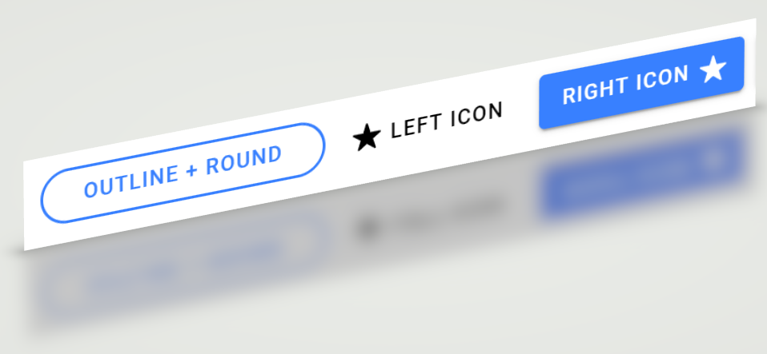
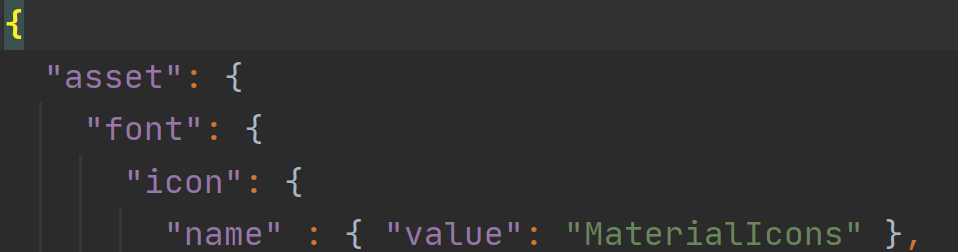
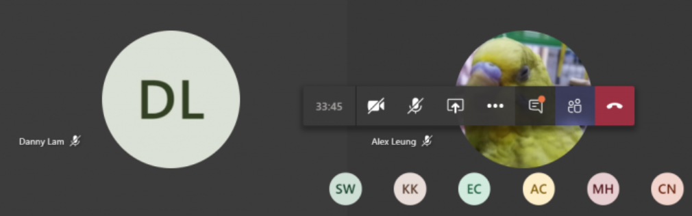
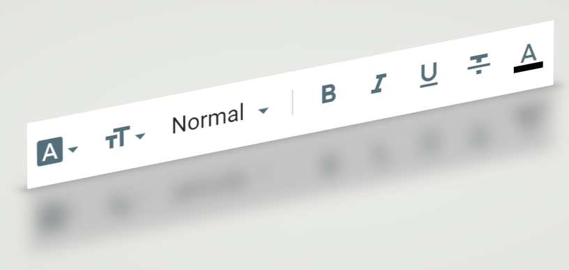

# Semantic Theming Voice and Fonts in Typography (CEM) — 2025 Revision

> Replacement for the [2020 article](https://blog.firsov.net/2020/08/semantic-theming-fonts-in-typography.html).
> This revision focuses on **consumer-flow purpose** (what the user is trying to do) and **semantic meaning**
> (what the content *is*), and translates that into **speech**, **fontography** and **typography** tokens
> that can be used consistently across products.
[discussion](https://github.com/EPA-WG/custom-element-dist/discussions/21) |
[git](https://github.com/EPA-WG/custom-element-dist/blob/develop/src/material/theme/tokens/cem-voice-fonts-typography.md)

**Companion specs:**
- **D0. Color (Emotional Palette)** ([`cem-colors.md`](./cem-colors.md)) — text contrast requirements
- **D1. Space & Rhythm** ([`cem-dimension.md`](./cem-dimension.md)) — reading rhythm validation
- **D2. Coupling & Compactness** ([`cem-coupling.md`](./cem-coupling.md)) — label sizing in compact modes
- **D3. Shape — Bend** ([`cem-shape.md`](./cem-shape.md)) — text container shaping
- **D5. Stroke & Separation** ([`cem-stroke.md`](./cem-stroke.md)) — text decoration, underlines
- **D7. Time & Motion** ([`cem-timing.md`](./cem-timing.md)) — text transition timing

---


## 1. Problem statement

Typography is a high-leverage part of semantic theming: it shapes comprehension, scanning efficiency,
and decision-making. Yet most systems treat it as “choose a font and a scale”. In consumer-facing products,
this is insufficient.

We need a **semantic** way to express typography so that:

- The same user intent produces the same typographic behavior across the product.
- Tokens are understandable by *consumers of a design system* (engineers, designers, product owners).
- Tokens remain stable even when brands change (typefaces can change without changing intent).

---

## 2. CEM lens: consumer flow and meaning

Typography decisions should be driven by two orthogonal dimensions:

1) **Consumer flow purpose** — what the user is doing at that moment:

- **Orient / Navigate** (find where you are)
- **Scan / Compare** (quickly evaluate options and differences)
- **Read / Learn** (sustained comprehension)
- **Act** (commit an action: click, submit, approve)
- **Confirm / Reflect** (understand results, status, and next steps)

2) **Semantic meaning of content** — what the content *is*:

- **Reading** (prose, explanations)
- **Script** (code, commands)
- **Initialism** (acronyms, avatar initials)
- **Iconized** (letter-as-icon)
- **Tag** (labels and compact descriptors)
- **Data** (numbers, measurements, identifiers)

The 2020 set covered the first five categories; this revision also adds **Data**,
because consumer “scan/compare/decide” flows rely heavily on numeric alignment and stable rendering.

---

## 3. Definitions

### 3.1 Fontography vs Typography vs Voice

- **Fontography tokens** describe the *font assets* and their feature policies.
    - Families, fallbacks, optical sizing, ligature policy, numeric features.

- **Typography tokens** describe how text is *laid out and perceived*.
    - Size scale, line height, letter spacing, casing rules, measure (line length), paragraph rhythm.

- **Voice tokens** describe *prominence* (how strongly content “speaks”) in a way that can be projected into:
    - **Ink channel (visual):** font weight and icon stroke thickness.
    - **Speech channel (vocal):** prosody for product “read aloud” (rate/pitch/volume) and optional SSML emphasis.

The critical rule: **voice is modality-independent semantics**; ink and speech are projections of voice.


---

## 4. Principles

### P1. Semantic intent first

Tokens should communicate intent (reading, data, tag) rather than implementation details (Roboto 14px).

### P2. Bounded variation

Humans recognize a limited number of distinct variations reliably. Prefer a compact set (e.g., 7 steps) for weight,
size, and spacing.

### P3. Accessibility by construction

Default tokens must work with user scaling and accessibility settings.

- Use `rem` for sizing.
- Preserve readable line-height for prose.
- Avoid micro text for critical content.

### P4. Internationalization and fallback are first-class

A semantic role must behave consistently across languages and glyph coverage.

### P5. Data is a distinct semantic

Numbers and identifiers require predictable alignment and glyph selection.

---

## 5. Token model

### 5.1 Token groups

1) **Fontography families (semantic aliases)**
2) **Thickness scale (bounded)**
3) **Typography size scale (bounded)**
4) **Typography line-height scale (role-based)**
5) **Typography tracking/casing policies**
6) **Typography feature policies** (numerics, ligatures, optical sizing)
7) **Typography reading ergonomics** (measure and paragraph rhythm)
8) **Voice semantics (cross-modal prominence)** mapped to:
    - Ink thickness (text weight / icon stroke)
    - Speech prosody (rate/pitch/volume) and optional SSML emphasis

### 5.2 Canonical tokens (CSS custom properties)

> These values are safe defaults. Brands override families first; products override density next.

```css
:root {
    /* =========================
     * 1) Fontography — semantic families
     * (consumer meaning first)
     * ========================= */

    /* Rule: font family stacks are theme-invariant (light/dark/contrast).
     * Override families only for brand, platform, or locale coverage.
     */

    /* Long-form reading / comprehension */
    --cem-fontography-reading-family: "Roboto", "Source Sans Pro",
    system-ui, -apple-system, "Segoe UI", "Helvetica Neue", Arial,
    "Noto Sans", "Liberation Sans", sans-serif;

    /* UI labels / navigation / compact scanning */
    --cem-fontography-ui-family: var(--cem-fontography-reading-family);

    /* Code / scripts */
    --cem-fontography-script-family: ui-monospace, "SFMono-Regular", Menlo, Monaco, Consolas,
    "Liberation Mono", "Courier New", "Noto Sans Mono", monospace;

    /* Initialism / condensed emphasis (optional override) */
    --cem-fontography-initialism-family: "Barlow Semi Condensed", "Roboto Condensed",
    var(--cem-fontography-ui-family);

    /* Brand / display (optional; alias until a brand face is chosen) */
    --cem-fontography-brand-family: var(--cem-fontography-reading-family);


    /* =========================
     * 2) Thickness — 7-step bounded scale
     * (aligns with theme-data.xhtml “Thickness” concept)
     * ========================= */
    --cem-thickness-xx-light: 100;
    --cem-thickness-x-light: 200;
    --cem-thickness-light: 300;
    --cem-thickness-normal: 400;
    --cem-thickness-bold: 700;
    --cem-thickness-x-bold: 800;
    --cem-thickness-xx-bold: 900;


    /* =========================
     * 3) Typography — 7-step size scale (rem-based)
     * =========================  *
     * Rule: size scale is theme-invariant. Contrast modes adjust ink/decoration, not the global scale.
     */
    --cem-typography-size-xxs: 0.75rem;
    --cem-typography-size-xs: 0.8125rem;
    --cem-typography-size-s: 0.875rem;
    --cem-typography-size-m: 1rem;
    --cem-typography-size-l: 1.125rem;
    --cem-typography-size-xl: 1.375rem;
    --cem-typography-size-xxl: 1.75rem;


    /* =========================
     * 4) Typography — line-height primitives
     * ========================= */
    --cem-typography-line-height-reading: 1.55;
    --cem-typography-line-height-ui: 1.2;
    --cem-typography-line-height-script: 1.4;
    --cem-typography-line-height-badge: 1;


    /* =========================
     * 5) Typography — tracking / casing primitives
     * ========================= */
    --cem-typography-letter-spacing-reading: normal;
    --cem-typography-letter-spacing-ui: 0.01em;
    --cem-typography-letter-spacing-caps: 0.08em;


    /* =========================
     * 6) Typography — feature policies
     * ========================= */
    --cem-typography-feature-numeric-data: tabular-nums lining-nums;
    --cem-typography-feature-ligatures-script: none;
    --cem-typography-feature-optical-sizing: auto;


    /* =========================
     * 7) Typography — reading ergonomics
     * ========================= */
    --cem-typography-reading-measure-max: 65ch;
    --cem-typography-reading-paragraph-gap: 0.75em;


    /* =========================
     * 8) Voice — cross-modal prominence
     * (same semantics for ink + speech)
     * ========================= */

    /* Ink projection (font weight / icon stroke strength)
     * All 7 thickness levels used for distinct voice-to-weight mapping:
     * whisper(100) → soft(200) → gentle(300) → regular(400) → firm(700) → strong(800) → loud(900)
     */
    --cem-voice-whisper-ink-thickness: var(--cem-thickness-xx-light);
    --cem-voice-soft-ink-thickness: var(--cem-thickness-x-light);
    --cem-voice-gentle-ink-thickness: var(--cem-thickness-light);
    --cem-voice-regular-ink-thickness: var(--cem-thickness-normal);
    --cem-voice-firm-ink-thickness: var(--cem-thickness-bold);
    --cem-voice-strong-ink-thickness: var(--cem-thickness-x-bold);
    --cem-voice-loud-ink-thickness: var(--cem-thickness-xx-bold);

    /* Icon stroke multiplier projection (optional; for stroke-based icon sets) */
    --cem-voice-whisper-icon-stroke-multiplier: 0.90;
    --cem-voice-soft-icon-stroke-multiplier: 0.95;
    --cem-voice-gentle-icon-stroke-multiplier: 1.00;
    --cem-voice-regular-icon-stroke-multiplier: 1.00;
    --cem-voice-firm-icon-stroke-multiplier: 1.10;
    --cem-voice-strong-icon-stroke-multiplier: 1.20;
    --cem-voice-loud-icon-stroke-multiplier: 1.30;

    /* Speech projection (product read-aloud; not screen-reader control) */
    --cem-voice-whisper-speech-volume: 0.65;
    --cem-voice-soft-speech-volume: 0.75;
    --cem-voice-gentle-speech-volume: 0.85;
    --cem-voice-regular-speech-volume: 1.00;
    --cem-voice-firm-speech-volume: 1.00;
    --cem-voice-strong-speech-volume: 1.00;
    --cem-voice-loud-speech-volume: 1.00;

    --cem-voice-whisper-speech-rate: 1.00;
    --cem-voice-soft-speech-rate: 1.00;
    --cem-voice-gentle-speech-rate: 1.00;
    --cem-voice-regular-speech-rate: 1.00;
    --cem-voice-firm-speech-rate: 0.98;
    --cem-voice-strong-speech-rate: 0.96;
    --cem-voice-loud-speech-rate: 0.94;

    --cem-voice-whisper-speech-pitch: 0.95;
    --cem-voice-soft-speech-pitch: 0.98;
    --cem-voice-gentle-speech-pitch: 1.00;
    --cem-voice-regular-speech-pitch: 1.00;
    --cem-voice-firm-speech-pitch: 1.03;
    --cem-voice-strong-speech-pitch: 1.06;
    --cem-voice-loud-speech-pitch: 1.10;

    /* SSML emphasis (optional; if your TTS engine supports SSML) */
    --cem-voice-whisper-ssml-emphasis: reduced;
    --cem-voice-soft-ssml-emphasis: reduced;
    --cem-voice-gentle-ssml-emphasis: moderate;
    --cem-voice-regular-ssml-emphasis: moderate;
    --cem-voice-firm-ssml-emphasis: moderate;
    --cem-voice-strong-ssml-emphasis: strong;
    --cem-voice-loud-ssml-emphasis: strong;


    /* =========================
     * Semantic endpoints
     * (consumer meaning visible at the front of the name)
     * ========================= */

    /* Reading */
    --cem-typography-reading-font-family: var(--cem-fontography-reading-family);
    --cem-typography-reading-font-size: var(--cem-typography-size-m);
    --cem-typography-reading-line-height: var(--cem-typography-line-height-reading);
    --cem-typography-reading-letter-spacing: var(--cem-typography-letter-spacing-reading);
    --cem-typography-reading-font-weight: var(--cem-voice-regular-ink-thickness);
    --cem-typography-reading-speech-volume: var(--cem-voice-regular-speech-volume);
    --cem-typography-reading-speech-rate: var(--cem-voice-regular-speech-rate);
    --cem-typography-reading-speech-pitch: var(--cem-voice-regular-speech-pitch);
    --cem-typography-reading-ssml-emphasis: var(--cem-voice-regular-ssml-emphasis);

    /* UI */
    --cem-typography-ui-font-family: var(--cem-fontography-ui-family);
    --cem-typography-ui-font-size: var(--cem-typography-size-m);
    --cem-typography-ui-line-height: var(--cem-typography-line-height-ui);
    --cem-typography-ui-letter-spacing: var(--cem-typography-letter-spacing-ui);
    --cem-typography-ui-font-weight: var(--cem-voice-gentle-ink-thickness);
    --cem-typography-ui-speech-volume: var(--cem-voice-gentle-speech-volume);
    --cem-typography-ui-speech-rate: var(--cem-voice-gentle-speech-rate);
    --cem-typography-ui-speech-pitch: var(--cem-voice-gentle-speech-pitch);
    --cem-typography-ui-ssml-emphasis: var(--cem-voice-gentle-ssml-emphasis);

    /* Tag */
    --cem-typography-tag-font-family: var(--cem-fontography-ui-family);
    --cem-typography-tag-font-size: var(--cem-typography-size-s);
    --cem-typography-tag-line-height: var(--cem-typography-line-height-ui);
    --cem-typography-tag-letter-spacing: var(--cem-typography-letter-spacing-ui);
    --cem-typography-tag-font-weight: var(--cem-voice-firm-ink-thickness);
    --cem-typography-tag-speech-volume: var(--cem-voice-firm-speech-volume);
    --cem-typography-tag-speech-rate: var(--cem-voice-firm-speech-rate);
    --cem-typography-tag-speech-pitch: var(--cem-voice-firm-speech-pitch);
    --cem-typography-tag-ssml-emphasis: var(--cem-voice-firm-ssml-emphasis);

    /* Script */
    --cem-typography-script-font-family: var(--cem-fontography-script-family);
    --cem-typography-script-font-size: var(--cem-typography-size-s);
    --cem-typography-script-line-height: var(--cem-typography-line-height-script);
    --cem-typography-script-letter-spacing: normal;
    --cem-typography-script-font-weight: var(--cem-voice-regular-ink-thickness);
    --cem-typography-script-font-variant-ligatures: var(--cem-typography-feature-ligatures-script);
    --cem-typography-script-speech-volume: var(--cem-voice-regular-speech-volume);
    --cem-typography-script-speech-rate: var(--cem-voice-gentle-speech-rate);
    --cem-typography-script-speech-pitch: var(--cem-voice-gentle-speech-pitch);
    --cem-typography-script-ssml-emphasis: var(--cem-voice-gentle-ssml-emphasis);

    /* Data */
    --cem-typography-data-font-family: var(--cem-fontography-ui-family);
    --cem-typography-data-font-size: var(--cem-typography-size-m);
    --cem-typography-data-line-height: var(--cem-typography-line-height-ui);
    --cem-typography-data-letter-spacing: var(--cem-typography-letter-spacing-ui);
    --cem-typography-data-font-weight: var(--cem-voice-regular-ink-thickness);
    --cem-typography-data-font-variant-numeric: var(--cem-typography-feature-numeric-data);
    --cem-typography-data-speech-volume: var(--cem-voice-regular-speech-volume);
    --cem-typography-data-speech-rate: var(--cem-voice-firm-speech-rate);
    --cem-typography-data-speech-pitch: var(--cem-voice-regular-speech-pitch);
    --cem-typography-data-ssml-emphasis: var(--cem-voice-regular-ssml-emphasis);

    /* Initialism */
    --cem-typography-initialism-font-family: var(--cem-fontography-initialism-family);
    --cem-typography-initialism-font-size: var(--cem-typography-size-s);
    --cem-typography-initialism-line-height: var(--cem-typography-line-height-badge);
    --cem-typography-initialism-letter-spacing: var(--cem-typography-letter-spacing-caps);
    --cem-typography-initialism-font-weight: var(--cem-voice-firm-ink-thickness);
    --cem-typography-initialism-text-transform: uppercase;
    --cem-typography-initialism-speech-volume: var(--cem-voice-firm-speech-volume);
    --cem-typography-initialism-speech-rate: var(--cem-voice-firm-speech-rate);
    --cem-typography-initialism-speech-pitch: var(--cem-voice-firm-speech-pitch);
    --cem-typography-initialism-ssml-emphasis: var(--cem-voice-firm-ssml-emphasis);

    /* Iconized */
    --cem-typography-iconized-font-family: var(--cem-fontography-initialism-family);
    --cem-typography-iconized-font-size: calc(var(--cem-typography-size-m) * 2);
    --cem-typography-iconized-line-height: var(--cem-typography-line-height-badge);
    --cem-typography-iconized-letter-spacing: var(--cem-typography-letter-spacing-caps);
    --cem-typography-iconized-font-weight: var(--cem-voice-strong-ink-thickness);
    --cem-typography-iconized-text-transform: uppercase;
    --cem-typography-iconized-speech-volume: var(--cem-voice-strong-speech-volume);
    --cem-typography-iconized-speech-rate: var(--cem-voice-strong-speech-rate);
    --cem-typography-iconized-speech-pitch: var(--cem-voice-strong-speech-pitch);
    --cem-typography-iconized-ssml-emphasis: var(--cem-voice-strong-ssml-emphasis);

    /* Brand / Display */
    --cem-typography-brand-font-family: var(--cem-fontography-brand-family);
    --cem-typography-brand-font-size: var(--cem-typography-size-xxl);
    --cem-typography-brand-line-height: 1.1;
    --cem-typography-brand-letter-spacing: normal;
    --cem-typography-brand-font-weight: var(--cem-voice-strong-ink-thickness);
    --cem-typography-brand-speech-volume: var(--cem-voice-strong-speech-volume);
    --cem-typography-brand-speech-rate: var(--cem-voice-strong-speech-rate);
    --cem-typography-brand-speech-pitch: var(--cem-voice-strong-speech-pitch);
    --cem-typography-brand-ssml-emphasis: var(--cem-voice-strong-ssml-emphasis);
}
```

### 5.3 Theme projections (dark and contrast)

Themes should *not* swap font families or rescale the type ramp. Instead, they project semantics into
**ink** (weight/stroke) and **decoration** (outlines/underlines), keeping layout stable.

**Dark theme:** slightly lighter ink weight to compensate for perceived boldness on dark backgrounds.

```css
:root[data-cem-theme="dark"] {
    /* Keep families and size scale unchanged; only adjust ink projection. */
    --cem-voice-whisper-ink-thickness: 100;
    --cem-voice-soft-ink-thickness: 180;
    --cem-voice-gentle-ink-thickness: 280;
    --cem-voice-regular-ink-thickness: 350; /* ≈ 400 but lighter */
    --cem-voice-firm-ink-thickness: 650; /* ≈ 700 but lighter */
    --cem-voice-strong-ink-thickness: 750; /* ≈ 800 but lighter */
    --cem-voice-loud-ink-thickness: 850; /* ≈ 900 but lighter */
}
```


**High-contrast theme:** preserve sizes; increase ink and add non-color cues where needed.

```css
:root[data-cem-theme="contrast"] {
    /* Prefer stronger ink steps (or nearest available weights for non-variable fonts). */
    --cem-voice-gentle-ink-thickness: 400;
    --cem-voice-regular-ink-thickness: 500;
    --cem-voice-firm-ink-thickness: 750;
    --cem-voice-strong-ink-thickness: 850;

    /* Optional: add decoration cues at component level (not shown here). */
}
```

---

## 6. Semantic typography roles

This section defines *what developers apply*. Each role is a stable semantic endpoint, with minimal knobs.

> Naming guideline: roles should describe **meaning/purpose**, not placement. Prefer `reading`, `data`, `tag` over
`body2`, `subtitle`.


### 6.1 Reading

| Used for | . |
|----------------------------------------------------------------|-------------- -----------------------|
| explanations, help text, descriptions, articles, long content |  |

Behavior:

```css
.cem-typography-reading {
    font-family: var(--cem-typography-reading-font-family);
    font-size: var(--cem-typography-reading-font-size);
    line-height: var(--cem-typography-reading-line-height);
    letter-spacing: var(--cem-typography-reading-letter-spacing);
    font-weight: var(--cem-typography-reading-font-weight);

    font-optical-sizing: var(--cem-typography-feature-optical-sizing);
    max-inline-size: var(--cem-typography-reading-measure-max);
}

.cem-typography-reading p {
    margin-block: 0 var(--cem-typography-reading-paragraph-gap);
}
```

### 6.2 UI (scan/navigate)

| Used for                                                      | .                                              |
|---------------------------------------------------------------|------------------------------------------------|
| navigation, button labels, form labels, menus, secondary text |  |

Behavior:

```css
.cem-typography-ui {
    font-family: var(--cem-typography-ui-font-family);
    font-size: var(--cem-typography-ui-font-size);
    line-height: var(--cem-typography-ui-line-height);
    letter-spacing: var(--cem-typography-ui-letter-spacing);
    font-weight: var(--cem-typography-ui-font-weight);

    font-optical-sizing: var(--cem-typography-feature-optical-sizing);
}
```

### 6.3 Tag

| Used for                                     | .                                   |
|----------------------------------------------|-------------------------------------|
| compact labels, chips, metadata, status tags |  |

Behavior:

```css
.cem-typography-tag {
    font-family: var(--cem-typography-tag-font-family);
    font-size: var(--cem-typography-tag-font-size);
    line-height: var(--cem-typography-tag-line-height);
    letter-spacing: var(--cem-typography-tag-letter-spacing);
    font-weight: var(--cem-typography-tag-font-weight);
}
```

### 6.4 Script

| Used for                                                  | .                                     |
|-----------------------------------------------------------|---------------------------------------|
| code blocks, commands, identifiers that must be copy-safe |  |

Behavior:

```css
.cem-typography-script {
    font-family: var(--cem-typography-script-font-family);
    font-size: var(--cem-typography-script-font-size);
    line-height: var(--cem-typography-script-line-height);
    letter-spacing: var(--cem-typography-script-letter-spacing);
    font-weight: var(--cem-typography-script-font-weight);

    font-variant-ligatures: var(--cem-typography-script-font-variant-ligatures);
}
```

### 6.5 Data (new)

Used for:

- numbers in tables, prices, measurements, timestamps, IDs

Reason:

- numeric alignment is crucial in scan/compare flows; use **tabular numerals**.

Behavior:

```css
.cem-typography-data {
    font-family: var(--cem-typography-data-font-family);
    font-size: var(--cem-typography-data-font-size);
    line-height: var(--cem-typography-data-line-height);
    letter-spacing: var(--cem-typography-data-letter-spacing);
    font-weight: var(--cem-typography-data-font-weight);

    font-variant-numeric: var(--cem-typography-data-font-variant-numeric);
}
```


### 6.6 Initialism

| Used for                                                        | .                                                |
|-----------------------------------------------------------------|--------------------------------------------------|
| acronyms, avatar initials, short codes meant to be “badge-like” |  |

Behavior:

```css
.cem-typography-initialism {
    font-family: var(--cem-typography-initialism-font-family);
    font-size: var(--cem-typography-initialism-font-size);
    line-height: var(--cem-typography-initialism-line-height);
    letter-spacing: var(--cem-typography-initialism-letter-spacing);
    font-weight: var(--cem-typography-initialism-font-weight);

    text-transform: var(--cem-typography-initialism-text-transform);
}
```

### 6.7 Iconized

| Used for                                             | .                                                        |
|------------------------------------------------------|----------------------------------------------------------|
| letter-as-icon (monograms, single-letter pictograms) |  |

Behavior:

```css
.cem-typography-iconized {
    font-family: var(--cem-typography-iconized-font-family);
    font-size: var(--cem-typography-iconized-font-size);
    line-height: var(--cem-typography-iconized-line-height);
    letter-spacing: var(--cem-typography-iconized-letter-spacing);
    font-weight: var(--cem-typography-iconized-font-weight);

    text-transform: var(--cem-typography-iconized-text-transform);
}
```

### 6.8 Brand / Display (optional)

Used for:

- marketing headers, hero blocks, brand moments

Behavior:

```css
.cem-typography-brand {
    font-family: var(--cem-typography-brand-font-family);
    font-size: var(--cem-typography-brand-font-size);
    line-height: var(--cem-typography-brand-line-height);
    letter-spacing: var(--cem-typography-brand-letter-spacing);
    font-weight: var(--cem-typography-brand-font-weight);
}
```

---

## 7. Consumer-flow mapping (how to choose roles)

Use this table as a decision shortcut.

| Consumer flow purpose | Dominant typography role(s)                          | Default voice level |
|-----------------------|------------------------------------------------------|---------------------|
| Orient / Navigate     | UI, Tag, Initialism                                  | gentle → firm       |
| Scan / Compare        | Data, UI, Tag                                        | regular → firm      |
| Read / Learn          | Reading                                              | regular             |
| Act                   | UI (often bold), Tag (when actions are chip-like)    | firm                |
| Confirm / Reflect     | Reading (explanations), Data (metrics), Tag (status) | regular → firm      |

---

## 8. Density and accessibility modes

Typography must respond to accessibility settings and product density.

### 8.1 Density tokens (optional extension)

If you need an explicit density switch, add one semantic knob:

```css
:root {
    --cem-typography-density: comfortable; /* compact | comfortable */
}
```

In compact density, prefer smaller sizes for UI and tags while keeping Reading stable.

### 8.2 Minimums

- Keep critical UI actions at `1rem`.
- Avoid reducing Reading line-height below `1.45`.
- Use `rem` so user scaling works.

### 8.3 Contrast modes

- **Do not** change font families as part of a contrast mode.
- **Do not** rescale the global type ramp for contrast modes; rely on user text scaling (`rem`) and density tokens.
- Contrast modes project primarily into **ink** (voice → `--cem-voice-*-ink-thickness`) and **non-color cues**
  (underlines, outlines, separators) to avoid layout shifts.

---

## 9. Internationalization and fallback

Semantic tokens must include fallback coverage.

Guidelines:

- Always include a broad Unicode fallback (e.g., Noto Sans / Noto Sans Mono).
- Prefer font stacks that preserve x-height and metrics consistency.
- Validate all semantic roles on the languages you ship.

---

## 10. Practical implementation notes

### 10.1 Design tokens vs component tokens

- **Design tokens** define the semantic roles (this document).
- **Component tokens** map roles onto components (e.g., Button label uses UI; Table cells use Data).

### 10.2 Voice vs screen readers vs product read-aloud

**Screen readers** primarily follow HTML semantics and ARIA, not CSS typography. Do not rely on voice tokens to control
assistive technology output.

**Voice tokens** are designed to provide consistent prominence across:

- **Ink (visual):** use `--cem-voice-*-ink-thickness` and optional `--cem-voice-*-icon-stroke-multiplier`.
- **Product “read aloud”:** use `--cem-typography-*-speech-*` tokens as inputs to your TTS layer.

### 10.3 Example: SpeechSynthesis integration

This example reads the active typography role’s speech tokens from computed style and applies them to a TTS utterance.

```js
function cemSpeak( el, text )
{
    const cs = getComputedStyle( el );

    // Choose one: read from the role tokens applied to the element.
    const rate = parseFloat( cs.getPropertyValue( '--cem-typography-reading-speech-rate' ) ) || 1;
    const pitch = parseFloat( cs.getPropertyValue( '--cem-typography-reading-speech-pitch' ) ) || 1;
    const volume = parseFloat( cs.getPropertyValue( '--cem-typography-reading-speech-volume' ) ) || 1;

    const utter = new SpeechSynthesisUtterance( text );
    utter.rate = rate;
    utter.pitch = pitch;
    utter.volume = volume;

    speechSynthesis.speak( utter );
}
```

### 10.4 Don’t over-tokenize

Start with these semantic roles:

- Reading
- UI
- Tag
- Data
- Script
- Initialism

Add Brand/Iconized only when a real use-case exists.

---

## 11. Summary

This revision replaces the “typography as style” mindset with **typography as semantics**, and introduces **voice** as a
cross-modal axis:

- **Fontography** provides stable intent-driven families and feature policies.
- **Typography** defines bounded, accessible, i18n-friendly layout behavior.
- **Voice** provides modality-independent prominence mapped to:
    - ink thickness (text weight / icon stroke)
    - speech prosody (rate/pitch/volume) and optional SSML emphasis
- A dedicated **Data** semantic completes the consumer scan/compare flow.

The result is a token set that stays understandable to consumers of the design system, stable across brand changes, and
reusable across visual and vocal presentations.
